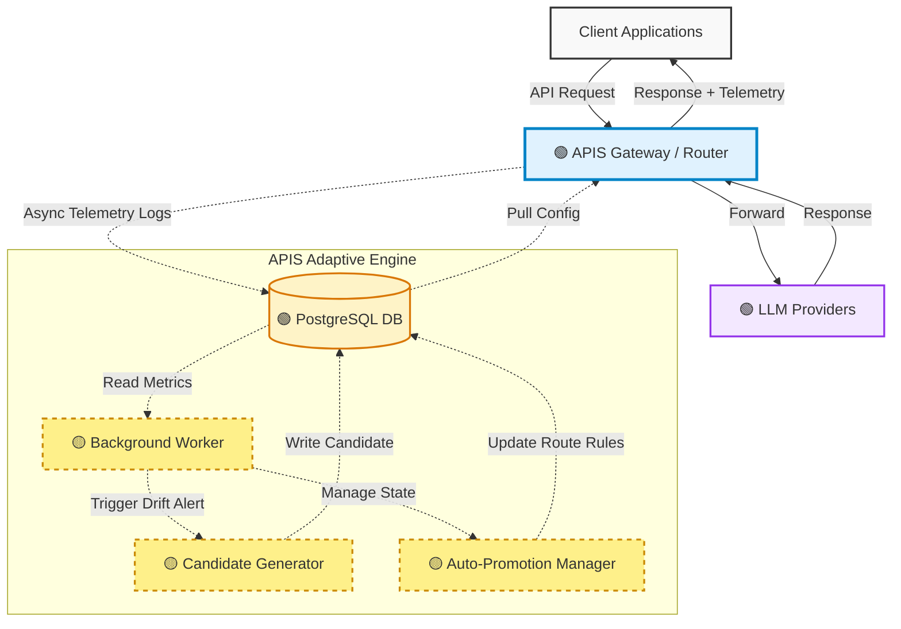
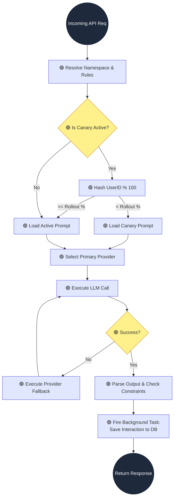
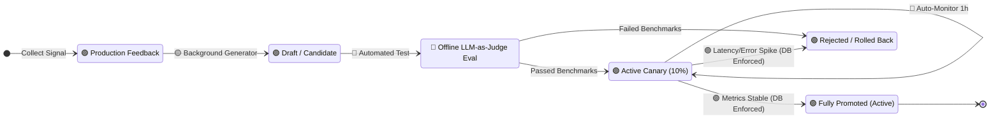
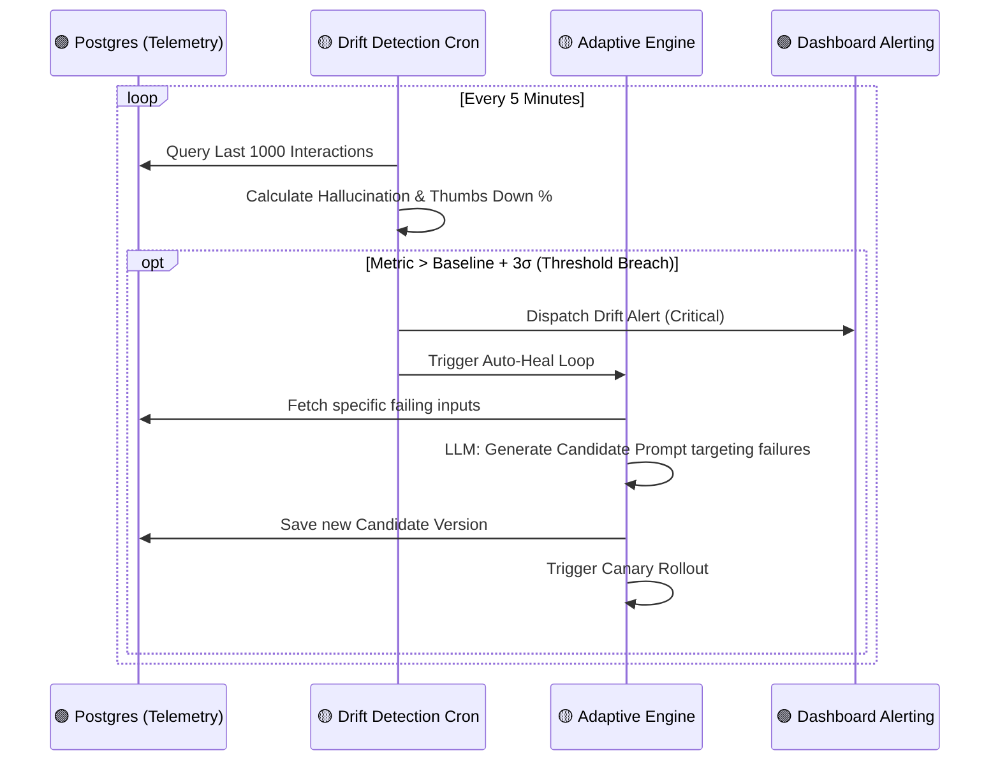
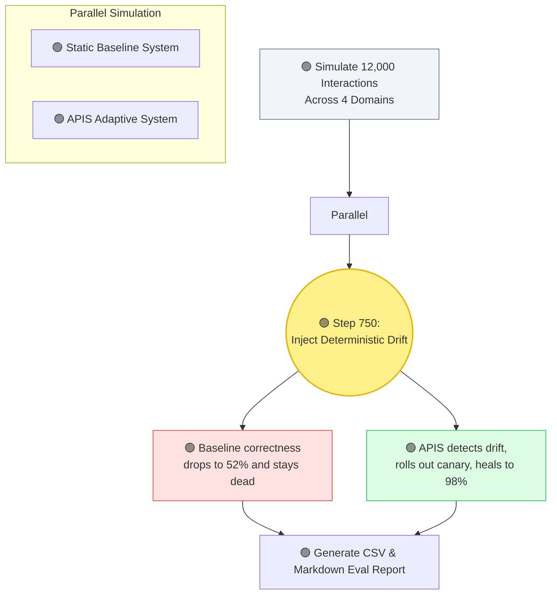

# APIS: Flagship Architecture & Diagrams

This document contains the architectural diagrams for the APIS (Adaptive Prompt Infrastructure System) project. To ensure transparency and trust with senior engineers, we favor absolute honesty regarding system maturity over hype.

**Architecture Maturity Legend:**
- 🟢 **Implemented:** Live in production / MVP codebase.
- 🟡 **Simulated / Validated:** Concept mathematically proven via the Phase 7 Deterministic Simulator, but not yet running as a live asynchronous daemon.
- 🔵 **Roadmap:** Aspirational components slated for future versions.

---

## 1. High-Level System Architecture

### Explanation
This diagram answers "What is APIS?" at a glance. It illustrates how client traffic flows through the implemented APIS Gateway, routing to various LLM providers, while telemetry is captured in PostgreSQL. The Adaptive Engine (simulated in v1) handles canary deployments, candidate generation, and drift detection.

### Design Rationale
The goal is to show APIS as an *infrastructure layer* sitting securely between the client and the LLM providers, clearly distinguishing the live runtime vs the simulated orchestration loops.

### Mermaid Source


---

## 2. Runtime Execution Flow

### Explanation
This diagram details the exact request path when a user hits the APIS endpoint. It proves backend depth by showing the router logic, fallback chains, and how telemetry is captured.

### Design Rationale
This maps to the FastAPI routing logic implemented in the backend, focusing on the resilient execution paths (fallback chains and fractional hashing).

### Mermaid Source


---

## 3. Prompt Evolution Lifecycle

### Explanation
This diagram explains the state machine of a prompt. It shows how user feedback translates into a new prompt version, goes through offline evaluation, hits production via a canary, and is finally promoted.

### Design Rationale
The state transitions represent strict enumerations enforced in the Postgres schema today, while the actual LLM-as-a-judge automated evaluation is clearly marked as roadmap.

### Mermaid Source


---

## 4. Canary Safety System

### Explanation
This diagram highlights the gradual rollout and safety nets. It proves to infrastructure engineers that APIS treats prompts with the same rigor as compiled backend binaries.

### Design Rationale
It distinguishes the *implemented* fractional routing and rollback execution from the *roadmap* automated scheduler that promotes traffic percentages chronologically.

### Mermaid Source
```mermaid
graph LR
    classDef version fill:#f8fafc,stroke:#94a3b8;
    classDef traffic fill:#bfdbfe,stroke:#3b82f6;
    classDef rollback fill:#fee2e2,stroke:#ef4444,stroke-width:2px;
    classDef success fill:#dcfce3,stroke:#22c55e,stroke-width:2px;

    V1[🟢 v1.0 Active<br/>90% Traffic]:::version
    V2[🟢 v1.1 Candidate<br/>10% Traffic]:::traffic
    
    V1 --- Monitor((🟡 Monitor Error Rate))
    V2 --- Monitor
    
    Monitor -->|🔵 Stable 1h<br/>(Cron Scheduler)| T25[🟢 v1.1 Canary 25%]:::traffic
    Monitor -->|🟢 Latency Spike!| RB[🟢 Automatic Rollback<br/>v1.0 = 100%]:::rollback
    
    T25 -->|🔵 Stable 1h| T50[🟢 v1.1 Canary 50%]:::traffic
    T50 -->|🔵 Stable 1h| Full[🟢 v1.1 Promoted<br/>100% Traffic]:::success
```

---

## 5. Proposed Drift Detection Architecture (Validated via Simulation)

### Explanation
This details the proposed observability and anomaly detection pipeline. It shows how the system notices "hidden degradation" (like creeping verbosity or hallucinations) before users complain.

### Design Rationale
Since the active 5-minute cron job is heavily simulated in the current MVP (via Phase 7 evaluation scripts), this diagram is labeled as a validated proposal rather than a live production component.

### Mermaid Source


---

## 6. Evaluation Framework

### Explanation
This diagram validates the research credibility of Phase 7. It visually explains the methodology of the 12,000-interaction simulation, the injected drift event, and how the Baseline and Adaptive systems diverged.

### Design Rationale
By showing two parallel timelines diverging after a specific event ("Drift Injected"), it instantly communicates the rigorous A/B testing methodology used to prove the system's mathematical viability.

### Mermaid Source


---

## 🎨 Exportable SVG/Figma-Ready Plan

To convert these Mermaid diagrams into best-in-class assets for your repository or slide decks:

1. **GitHub README:** Paste the raw ` ```mermaid ` blocks directly into `README.md`. GitHub natively renders them in dark/light mode matching the user's OS preference.
2. **Figma / Slide Decks:** 
   - Open the [Mermaid Live Editor](https://mermaid.live).
   - Paste the code blocks above.
   - Click **Actions -> Export SVG**.
   - Drag the SVG into Figma. Because it's an SVG, all shapes and text will be fully editable vectors. You can then apply your specific APIS brand colors (e.g., your Next.js dashboard's exact HSL values) to make them look identical to the UI.
