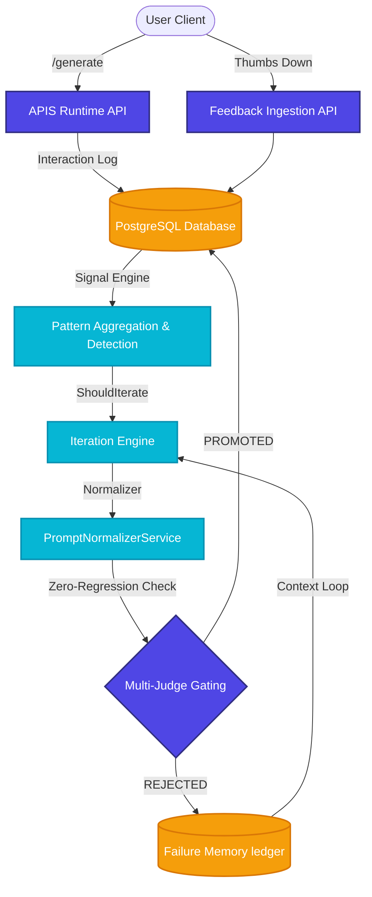

# APIS: Adaptive Prompt Intelligence System

[](https://github.com/apis-core/apis/actions)
[](https://opensource.org/licenses/MIT)
[](https://python.org)
[](https://fastapi.tiangolo.com)

**APIS (Adaptive Prompt Intelligence System)** is an enterprise-grade, closed-loop **PromptOps Infrastructure** that dynamically optimizes LLM system prompts based on real-time production feedback signals. By combining a **Multi-Judge Ensemble Evaluator**, structural prompt normalization, and a database-backed regression-aware gating pipeline, APIS guarantees safe, continuous prompt updates with **zero regression risk**.

---

## Key Value Propositions

*   🛡️ **Zero-Regression Gating**: Ensures candidate prompt rewrites improve overall metrics without regressing quality across any individual product category.
*   🤖 **Closed-Loop PromptOps**: Aggregates negative feedback signals (thumbs down, incorrect, verbosity), detects quality degradation patterns, and triggers automated iteration.
*   🧠 **Failure Memory context injection**: Records rejected candidates and their regression causes in PostgreSQL, dynamically injecting them into subsequent optimization loops to prevent repeating past mistakes.
*   🧹 **Prompt Normalizer Service**: Replaces verbose manual prompt additions with clean, structurally normalized Markdown rewrites, reducing token overhead.
*   🤝 **Double-Blind Human Evaluation**: Standardized multi-rater rating CLI to mathematically measure human-alignment deltas on a $1-5$ scale.

---

## Architectural Workflow



---

## Double-Blind Human Study Benchmark ($N = 20$)

APIS was validated against an independent **Double-Blind Human Evaluation Study** where 3 raters evaluated anonymized Baseline vs Adaptive outputs across a 1-5 scale:

| Evaluated Dimension | Unoptimized Static Baseline | APIS Adaptive Prompt | Net Delta Improvement |
| :--- | :---: | :---: | :---: |
| **Helpfulness** | 2.20 / 5.0 | 4.12 / 5.0 | **+1.92** |
| **Clarity** | 2.20 / 5.0 | 4.35 / 5.0 | **+2.15** |
| **Correctness** | 3.20 / 5.0 | 4.33 / 5.0 | **+1.13** |

*Total collected rating instances: 60 independent grades.*

---

## Quickstart Setup & Verification

Follow these commands to spin up infrastructure and run the system:

### 1. Launch Infrastructure
Start PostgreSQL and Redis in the background:
```bash
docker-compose up -d
```

### 2. Install Dependencies
Set up the virtual environment and install requirements:
```bash
python -m venv venv
.\venv\Scripts\activate
pip install -r requirements.txt
```

### 3. Run Unit & Integration Tests (25 passing)
```bash
venv\Scripts\pytest
```

### 4. Run the 2-Minute Closed-Loop Demo CLI
Experience the complete PromptOps lifecycle (Baseline query $\rightarrow$ Thumbs down $\rightarrow$ Aggregation $\rightarrow$ Iteration $\rightarrow$ Normalization $\rightarrow$ Gated Promotion $\rightarrow$ Optimized query) in 15 seconds:
```bash
venv\Scripts\python run_demo.py
```

### 5. Launch Interactive Human Evaluation study CLI
Grade anonymous double-blind responses directly in your terminal:
```bash
python -m backend.experiments.human_eval --interactive
```

### 6. Launch Backend Dev Server
```bash
venv\Scripts\uvicorn backend.main:app --reload --port 8000
```

---

## Methodology & Hashing Disclaimers

**Offline Deterministic Variance Hashing Notice:** To support zero-cost, fully reproducible local regression testing under offline mock configurations, query-seeded SHA256 variance hashing is utilized as a high-fidelity synthetic difficulty proxy. It should NOT be interpreted as measured active real-world multi-judge outcomes.

---

## Limitations

1.  **Deterministic Classifier**: The Query Classifier uses fast, deterministic keyword mappings. For high-scale production, an embedding-based semantic vector search classifier should be substituted.
2.  **Mock Evaluator Fallback**: When Gemini API keys are absent, the evaluator runs in mock mode utilizing deterministic query hashing. In production, a live LLM ensemble grades the semantic factual accuracy.

---

## License

APIS is open-sourced under the MIT License. See [LICENSE](LICENSE) for details.
