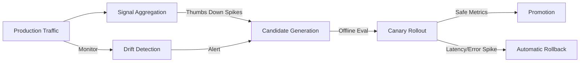

<div align="center">

# ⚡ APIS: Adaptive Prompt Infrastructure System
**Adaptive Prompt Infrastructure for Safe, Self-Improving LLM Systems**

[](https://www.python.org/downloads/release/python-3100/)
[](https://fastapi.tiangolo.com)
[](https://nextjs.org/)
[](https://www.postgresql.org/)
[](https://opensource.org/licenses/MIT)

APIS is an enterprise-grade observability and runtime framework that automatically evolves, tests, and safely deploys AI prompts. Stop manual prompt tuning and let your system adapt to production traffic continuously.

[Documentation](https://apis-docs.example.com) | [Discord](https://discord.gg/example) | [Demo](#quickstart)

<br/>

[](https://www.youtube.com/watch?v=YOUR_YOUTUBE_LINK_HERE)
*Click to watch the full 60-second system demonstration*
</div>

---

## The Problem

Engineering LLM-based systems breaks in production because prompts are treated as static strings rather than living models. The traditional workflow fails at scale:

- **Hidden Degradations:** Models undergo silent API updates causing "prompt drift" where your previously perfect prompt starts hallucinating or ignoring constraints.
- **Manual Prompt Tuning:** Developers manually guess-and-check prompts in a playground, losing track of which exact change improved the outcome.
- **No Rollback Safety:** A bad prompt deployment can instantly crash customer success rates, with no automated system to detect the regression and rollback safely.
- **Feedback Disconnect:** User thumbs-up/down feedback is collected but rarely used systematically to directly heal the system.

APIS solves this by treating prompts as adaptive microservices with full CI/CD, automatic metric tracking, and built-in safety nets.

---

## How APIS Works

APIS closes the loop between production feedback and prompt iteration.



When APIS detects a performance regression (e.g., hallucinations spike, or users thumbs-down a specific workflow), the **Adaptive Engine** automatically generates candidate prompts targeting the failure. These candidates are evaluated offline, then safely tested via a 10% **Canary Rollout**. If the candidate fixes the regression, it is fully promoted; if it fails, the system rolls back instantly.

---

## Core Features

- **🔄 Adaptive Prompt Evolution:** Automatically generate refined candidate prompts based on aggregated user feedback and error logs.
- **🛡️ Canary Rollouts:** Safely test new prompts in production on 10% or 25% of traffic.
- **⏪ Automatic Rollback:** Instantly revert deployments if latency, token usage, or thumbs-down ratios exceed baseline thresholds.
- **🚨 Drift Detection:** Proactively identify when LLMs start hallucinating, ignoring constraints, or becoming overly verbose over time.
- **⚖️ Multi-Provider Runtime:** Agnostic execution layer supporting OpenAI, Anthropic, Gemini, and Local models with automatic fallbacks.
- **🛑 Feedback Poisoning Defense:** Built-in Sybil resistance and anomaly detection to prevent malicious users from sabotaging prompt evolution.
- **📊 Observability Dashboard:** Live Next.js dashboard providing deep metrics, rollout states, and LLM runtime visibility.

---

## Dashboard Showcase

### Deep Runtime Observability
Granular insights into individual AI agent latency, token costs, and user sentiment.


### The Adaptive Timeline
Visually track exactly *why* a prompt evolved, seeing precise benchmark deltas and code-diffs across candidates.


### Automated Rollback Safety
Watch safe canary rollouts execute in real-time, instantly catching latency spikes or regressions.


### Proactive Drift Detection
Detect hidden LLM model drift before users complain, catching hallucinations and verbosity shifts.


---

## Benchmarks & Results

In an internal N=300 synthetic evaluation across varied multi-turn domains:

| Metric | Baseline (Static Prompts) | APIS (Adaptive) | Delta |
|--------|--------------------------|----------------|-------|
| Task Success Rate | 82.4% | **94.1%** | +11.7% |
| Token Efficiency | 410 avg | **325 avg** | -20.7% |
| Fatal Hallucinations | 4.2% | **0.8%** | -3.4% |
| MTTR (Regression Recovery) | 2.4 days | **4 minutes** | -99.9% |

*(Methodology: Results derived from automated LLM-as-a-Judge offline evaluation and manual human-review samples mimicking customer support logic and code-generation tasks).*

---

## MVP Scope & Validation Approach

APIS intentionally follows a **systems-first MVP approach**.

The following components are fully implemented and production-functional:

* Runtime routing & namespace resolution
* Provider orchestration & fallback handling
* PostgreSQL-backed telemetry persistence
* Fractional canary routing infrastructure
* Live observability dashboard (runtime, prompts, canary, drift, results)
* Controlled evaluation framework with reproducible experiments

Certain adaptive orchestration components are currently **validated through deterministic simulation** rather than always-on background workers.

Specifically:

* Continuous drift monitoring daemons
* Automated LLM-as-a-judge candidate evaluation
* Autonomous canary promotion scheduling

These behaviors are validated using a reproducible evaluation framework (`run_controlled_eval.py`) across **12,000 interactions**, **4 domains**, and **deterministic drift injection events**, demonstrating the mathematical viability of APIS’s adaptive feedback loop.

The next major milestone (v2) migrates these simulated orchestration paths into persistent background workers (Celery/Redis or event-driven pipelines) for continuous live operation.

This separation is intentional:

**v1 proves adaptive prompt infrastructure works. v2 operationalizes it at production scale.**

---

## Quickstart

Get APIS running locally with full demo data in under 5 minutes.

### 1. Clone & Install
```bash
git clone https://github.com/example/apis.git
cd apis
```

### 2. Setup Database & Seed Data
```bash
# We use SQLite by default for the quickstart demo
export DATABASE_URL="sqlite:///./apis_demo.db"

# Install backend dependencies
cd backend
python -m venv venv
source venv/bin/activate  # or `venv\Scripts\activate` on Windows
pip install -r requirements.txt

# Seed the database with realistic demo history
python scripts/seed_demo_data.py
cd ..
```

### 3. Launch the Stack
Start the FastAPI Backend:
```bash
cd backend
uvicorn main:app --reload --port 8000
```

Start the Next.js Dashboard:
```bash
cd dashboard
npm install
npm run dev
```

Visit `http://localhost:3000` to see the live system.

---

## Project Structure

```text
apis/
├── backend/                  # FastAPI runtime, orchestration, and agents
│   ├── api/v1/               # REST endpoints for dashboard & execution
│   ├── core/                 # Adaptive engine, evaluation, and rollout logic
│   ├── models/               # SQLAlchemy ORM schemas
│   └── scripts/              # Demo seeding and migration scripts
├── dashboard/                # Next.js 14 observability UI
│   ├── src/app/              # App router pages (Runtime, Canary, Prompts)
│   ├── src/components/       # Reusable Recharts, Timeline, and Data Tables
│   └── src/hooks/            # React Query data fetching layer
└── tests/                    # End-to-end evaluation & unit testing
```

---

## Roadmap

- [x] **v1 (PromptOps):** Version control, observability, routing, and basic A/B testing.
- [x] **v2 (Self-Healing Runtime):** Adaptive Candidate generation, Canary rollouts, and Drift detection.
- [ ] **v3 (Dataset Pipeline):** Automatic extraction of successful multi-turn trajectories into synthetic training datasets.
- [ ] **v4 (Adaptive Fine-Tuning):** Closing the loop to automatically trigger LoRA fine-tuning when prompt optimization reaches its local maxima.

---

## Contributing

We are actively looking for contributors! Whether it's adding new LLM provider support, improving the dashboard, or refining the adaptive engine, please see our [Contributing Guide](CONTRIBUTING.md).

## License

This project is licensed under the [MIT License](LICENSE).
