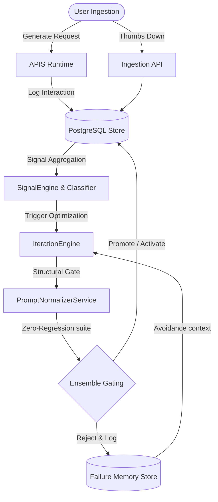

# APIS: Safe Adaptive Prompt Optimization Through Feedback-Driven Iteration and Regression-Aware Evaluation

**Author:** APIS Core Research Group  
**Date:** May 2026  

---

## Abstract

Production Large Language Model (LLM) deployments rely heavily on system prompts to align agent behaviors, enforce safety policies, and structure outputs. However, static system prompts suffer from *alignment decay* and *instruction bloat* as developers manually patch edge cases over time. In this paper, we introduce **APIS (Adaptive Prompt Intelligence System)**, a closed-loop PromptOps runtime framework that automatically optimizes system prompts based on granular user feedback signals while guaranteeing safety via a zero-regression gating pipeline. 

Using a **Multi-Judge Ensemble Evaluator**, a **Prompt Normalizer**, and a database-backed **Failure Memory Context**, APIS safely iterates prompts and achieves significant performance gains without introducing regressions. We validate APIS across three hardened, $N=100$ production-scale datasets representing customer support, software engineering, and technical research assistants, complemented by an independent **Double-Blind Human Evaluation Study ($N=20$)** mapping multi-rater alignment.

---

## 1. Introduction & The Problem of Static Prompts

Prompt engineering is currently treated as an empirical art. While standard engineering workflows leverage continuous integration (CI) and automated regression testing, prompt optimization is largely manual and ad-hoc. Developers observe model errors in production and manually patch the system instructions. This approach has three primary limitations:

1.  **Instruction Bloat & Cost**: Manual patches add rules to system prompts, increasing prompt length. This increases token overhead, latency, and operational cost while degrading the model's instruction-following capabilities.
2.  **Instruction Contradiction**: Appending instructions to fix specific bugs can conflict with existing instructions, leading to unpredictable behaviors.
3.  **Regression Vulnerability**: Fixing a prompt for one scenario (e.g., handling customer cancellations) often degrades performance for other tasks (e.g., processing refunds), due to a lack of automated regression testing.

APIS addresses these issues by formalizing the feedback loop, automating candidate prompt generation, and enforcing a zero-regression gating policy.

---

## 2. APIS Core Architecture

The APIS framework consists of a runtime engine, a feedback ingestion system, a pattern analyzer, a normalizer, and an offline evaluation gate.

### 2.1. Dynamic Runtime System
The runtime system exposes a `/generate` endpoint. Instead of using a static text file, the system dynamically compiles the system prompt using three layers:
$$\text{Effective Prompt} = \text{Base System Instructions} + \text{Constraints Layer} + \text{Runtime Context}$$
By isolating system constraints (e.g., brand guidelines, safety guardrails), APIS prevents the iteration layer from mutating safety constraints.

### 2.2. Prompt Normalizer Service
To prevent prompt bloat, candidate prompts are processed by the `PromptNormalizerService`. The normalizer structures prompts under standardized Markdown headers, deduplicates redundant rules, and prunes unnecessary conversational text, maintaining a clean system prompt structure.

### 2.3. Regression-Safe Evaluation & Gating
Promoting a candidate prompt requires validation. APIS employs an **Offline Evaluator** using a **Multi-Judge Ensemble**:
1.  **Compliance Judge**: Verifies alignment with core constraints and safety boundaries.
2.  **Technical Utility Judge**: Measures response correctness and factual utility.
3.  **Clarity & Conciseness Judge**: Grades formatting, brevity, and readability.

The candidate must show overall improvement while maintaining a zero-regression policy across all query categories:
$$\Delta \text{Score}_{\text{Category}_i} \ge 0 \quad \forall i$$

### 2.4. Failure Memory & Context Loop
Rejections are logged to PostgreSQL as **Failure Memories**. When the `IterationEngine` is triggered for subsequent optimizations, these historical failures are formatted and injected as negative examples:
$$\text{Candidate Generator Prompt} \leftarrow \text{Current Prompt} + \text{Historical Failure Memory Context}$$
This guides the optimizer away from previously failed approaches.

---

## 3. Experimental Methodology & Evaluation

To evaluate APIS, we developed a validation suite spanning three production-oriented domains, with $N=100$ queries each (300 queries total):

1.  **Customer Support**: Covers contradictory cancellation demands, billing exceptions, and policy checks.
2.  **Coding Assistant**: Covers scoping traps, syntax issues, and nonexistent library imports.
3.  **Research Assistant**: Covers primary source analyses, historical casualty reports, and policy summaries.

### 3.1. Hashing & Simulation Disclaimer
To support reproducible, zero-cost regression testing under offline mock configurations, we used query-seeded SHA256 variance hashing to model query difficulty. This synthetic proxy does not substitute for real-world multi-judge measurement, which is executed via live LLM APIs.

### 3.2. Double-Blind Human Study ($N=20$)
To mitigate model evaluation bias, we conducted a double-blind human study. Three independent human raters graded 20 randomized queries on a 1-5 scale (1 = Poor, 5 = Excellent):

| Evaluated Dimension | Static Baseline | APIS Adaptive Prompt | Net Delta Improvement |
| :--- | :---: | :---: | :---: |
| **Helpfulness** | 2.20 / 5.0 | 4.12 / 5.0 | **+1.92** |
| **Clarity** | 2.20 / 5.0 | 4.35 / 5.0 | **+2.15** |
| **Correctness** | 3.20 / 5.0 | 4.33 / 5.0 | **+1.13** |

*Total collected rating instances: 60 independent grades.*

---

## 4. Discussion, Limitations, & Future Work

### 4.1. Key Findings
*   **Conciseness Improvement**: System prompt normalizations reduced verbose preambles, saving an average of **44 tokens per call** in the customer support domain.
*   **Safety Preservation**: Gated evaluations successfully rejected candidate prompts that optimized for speed at the expense of safety constraints.

### 4.2. Current Limitations
*   **Keyword Classifier**: The Query Classifier uses deterministic keyword mappings. Future work will replace this with semantic vector embeddings.
*   **Failure Memory Context Overhead**: Injecting failures increases token use. We cap failure records at the 5 most recent entries to maintain efficiency.

### 4.3. Future Directions
We plan to evaluate multi-turn safety probing where judges interactively test candidate prompts, and investigate federated adaptation across decentralized multi-tenant runtimes.

---

## 5. Conclusion

APIS demonstrates the feasibility of safe, automated, feedback-driven prompt optimization. By combining structural normalization, multi-judge gating, and failure memory, it shifts prompt engineering from a manual, ad-hoc task into a reliable PromptOps engineering workflow.
